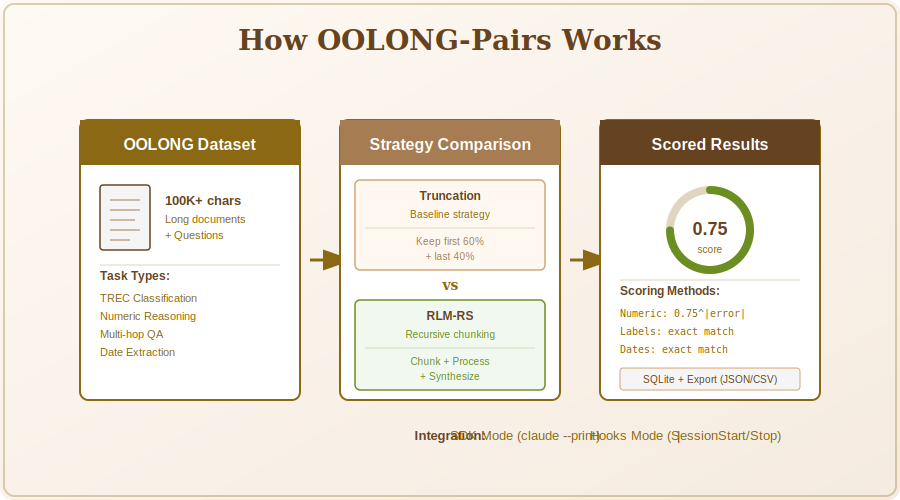

# OOLONG-Pairs Benchmark Harness

[](https://python.org)
[](LICENSE)
[](https://claude.ai/code)
[](https://huggingface.co/datasets/oolongbench/oolong-synth)

A benchmark harness for testing Claude Code plugins against the OOLONG long-context reasoning benchmark. Designed specifically for A/B testing the [rlm-rs](https://github.com/zircote/rlm-rs) memory plugin against baseline truncation strategies.

<p align="center">
  
</p>

## Overview

OOLONG-Pairs evaluates long-context reasoning capabilities by presenting tasks that require understanding large documents (100k+ characters). This harness compares two strategies:

1. **Truncation Strategy**: Naive context truncation to fit within window limits
2. **RLM-RS Strategy**: Recursive Language Model chunking via the rlm-rs plugin

## Installation

```bash
# Clone the repository
git clone https://github.com/zircote/oolong-pairs.git
cd oolong-pairs

# Install with uv
uv sync

# Or with pip
pip install -e .
```

## Prerequisites

- Python 3.11+
- Claude CLI installed and configured (`claude --version`)
- For RLM-RS strategy: [rlm-rs](https://github.com/zircote/rlm-rs) installed (`cargo install rlm-rs`)

## Usage

### SDK Mode (Recommended)

Run benchmarks programmatically using the Claude CLI:

```bash
# Run with truncation strategy
oolong-pairs run --strategy truncation --limit 10

# Run with RLM-RS chunking strategy
oolong-pairs run --strategy rlm_rs --limit 10

# Filter by dataset and context length
oolong-pairs run --strategy rlm_rs --dataset trec_coarse --min-context 100000
```

### Hooks Mode

For integration with Claude Code sessions using hooks:

```bash
# Set environment variables
export OOLONG_STATE_DIR=/tmp/oolong-pairs
export OOLONG_DB_PATH=data/benchmark.db

# Run via Python orchestrator
python -c "
from oolong_pairs.orchestrator import HooksOrchestrator
from oolong_pairs.models import Strategy
from pathlib import Path

orch = HooksOrchestrator(
    strategy=Strategy.RLM_RS,
    db_path=Path('data/benchmark.db'),
)
run_id = orch.run_benchmark(limit=5)
print(f'Completed run: {run_id}')
"
```

### View Results

```bash
# Show results for a specific run
oolong-pairs show <run_id>

# List recent runs
oolong-pairs list-runs

# Compare two runs
oolong-pairs compare <run_id_1> <run_id_2>

# Export results
oolong-pairs export <run_id> results.json --format json
```

### Dataset Statistics

```bash
# View dataset statistics
oolong-pairs stats --dataset trec_coarse
```

## CLI Commands

| Command | Description |
|---------|-------------|
| `run` | Execute benchmark with specified strategy |
| `show` | Display results for a benchmark run |
| `compare` | Compare two benchmark runs side-by-side |
| `list-runs` | List recent benchmark runs |
| `export` | Export results to JSON, JSONL, or CSV |
| `stats` | Show dataset statistics |

### Run Options

| Option | Default | Description |
|--------|---------|-------------|
| `--strategy` | Required | `truncation` or `rlm_rs` |
| `--mode` | `sdk` | Execution mode: `sdk` or `hooks` |
| `--limit` | None | Maximum tasks to run |
| `--min-context` | 100,000 | Minimum context length in characters |
| `--dataset` | `trec_coarse` | Dataset filter |
| `--db` | `data/benchmark.db` | Database path |

## Scoring

Scoring follows the OOLONG paper methodology:

- **Numeric answers**: `score = 0.75^|error|` where error is the absolute difference
- **Label answers**: Exact match (case-insensitive)
- **Comparison answers**: Semantic match for more/less/same variants
- **Date answers**: Exact match

## Architecture

```
oolong-pairs/
├── src/oolong_pairs/
│   ├── cli.py           # Click CLI interface
│   ├── dataset.py       # HuggingFace dataset loading
│   ├── models.py        # Pydantic data models
│   ├── orchestrator.py  # Hooks mode orchestration
│   ├── scoring.py       # Answer scoring logic
│   ├── storage.py       # SQLite persistence
│   └── strategies.py    # Execution strategies
├── hooks/
│   ├── hooks.json       # Claude Code hook configuration
│   ├── session_start.py # Injects benchmark context
│   └── stop.py          # Captures and scores answers
└── tests/
    └── test_scoring.py  # Scoring logic tests
```

## Strategies

### Truncation Strategy

Truncates context to fit within the context window (default 180k chars):
- Keeps first 60% and last 40% of content
- Simple baseline for comparison

### RLM-RS Strategy

Uses the Recursive Language Model pattern:
1. Chunks document using rlm-rs semantic chunker
2. Processes each chunk with Haiku (subcall model)
3. Synthesizes findings with Sonnet (main model)
4. Returns final answer

## Running Tests

```bash
# Run all tests
uv run pytest

# Run with coverage
uv run pytest --cov=oolong_pairs
```

## Database Schema

Results are stored in SQLite with two tables:

- **runs**: Benchmark run metadata (id, timestamp, strategy, mode, stats)
- **results**: Individual task results (task_id, score, latency, answer, error)

## License

MIT
